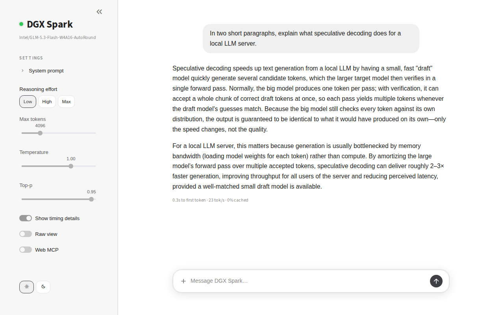

# vllm-chat

A small, stateless chat front-end for a local [vLLM](https://github.com/vllm-project/vllm) server. One Python file,
no database, no accounts, nothing logged. Point it at `http://<host>:8000`, open it in a browser, talk to the model.



Built for testing models on home inference boxes (DGX Spark, RTX rigs) where you want a quick, clean UI rather than a
full platform. Works with any OpenAI-compatible `/v1/chat/completions` endpoint; the extras (thinking level,
cache-hit %) light up when the server is vLLM.

## Features

- Streaming replies with a stop button in the composer, "Thought for Ns" expander for reasoning models
- Image attachments (＋ in the composer) for vision models
- Model-family profiles with a Thinking level control: GLM Low/High/Max, Qwen Off/Low/Medium/XHigh, generic. Guessed from the model id, or set per server
- Max tokens, temperature, top-p, optional system prompt
- Timing line per reply: time to first token, tok/s, prefix-cache hit % (from vLLM `/metrics`)
- Raw view: the exact request JSON and response summary under each reply
- Optional tool calling against an MCP server (built for [web-mcp](https://github.com/mike-nott/web-mcp)); off by default
- Several servers in one instance with a sidebar picker; light and dark; a status dot that says whether the server is up
- Zero persistence: conversation lives in the browser session only. Refresh to start over

## Quick start

```bash
git clone https://github.com/mike-nott/vllm-chat ~/vllm-chat
cd ~/vllm-chat
pip install -r requirements.txt        # or: uv tool install --with requests --with watchdog streamlit
bash run.sh                            # http://<this-host>:8501 → talks to http://127.0.0.1:8000
```

vLLM on another host or port: `VLLM_URL=http://192.168.1.10:8000 bash run.sh`, or create `servers.toml` (next section).

## Configure servers

```bash
cp servers.example.toml servers.toml
```

```toml
title = "vLLM"

[[servers]]
name = "GLM box"
base_url = "http://192.168.1.10:8000"
profile = "glm"          # glm | qwen | generic — optional, guessed from the model id if omitted

[[servers]]
name = "Qwen box"
base_url = "http://192.168.1.11:8000"
```

| profile | sidebar control | what is sent |
|---|---|---|
| `glm` | Thinking level Low / High / Max | `chat_template_kwargs.reasoning_effort`, prior reasoning passed back as `reasoning` |
| `qwen` | Thinking level Off / Low / Medium / XHigh | `chat_template_kwargs.enable_thinking` (Off = `false`) and `reasoning_effort` for the other levels, prior reasoning passed back |
| `generic` | none | plain OpenAI chat |

`servers.toml` is git-ignored, so `git pull` never overwrites it. The app re-reads it on every page load.

## Run as a service (port 80)

```bash
bash install.sh              # or PORT=8501 bash install.sh
```

Installs streamlit (via `uv` if present, else `pip --user`), creates `servers.toml` from the example if missing, renders
`vllm-chat.service` for your user and directory, and enables it. Port 80 works without root through
`AmbientCapabilities=CAP_NET_BIND_SERVICE`. Updating later is `git pull`: streamlit hot-reloads `app.py`
(that is what `watchdog` is for), so no restart is needed.

## Tools (MCP)

Add to `servers.toml`:

```toml
[mcp]
url = "https://your-worker.example.workers.dev/mcp"
token = "your-bearer-token"
```

The **Web MCP** toggle is always in the sidebar, off by default. Without an `[mcp]` section it is greyed out with a
tooltip saying what to add; it also stays greyed out for the `generic` profile. When on, the server's tools are
passed as OpenAI `tools` with `tool_choice: auto`; streamed tool calls are executed over MCP Streamable HTTP and fed
back as `role: tool` messages, up to 6 rounds. Every call, its arguments and its result sit in one collapsed
**Tools · N calls** row above the reply. Any MCP endpoint that speaks Streamable HTTP with bearer auth and returns text
content should work; [web-mcp](https://github.com/mike-nott/web-mcp) (Reddit, X, YouTube, web search, page fetch) is
what it was built against.

## Privacy

Nothing is written to disk. Conversation state is Streamlit session state in the browser tab. Streamlit usage
statistics are off. vLLM's own access log records method, path and status, not prompt content. The MCP token, if you
use one, lives in plain text in `servers.toml`, which is git-ignored for that reason.

## Files

| file | purpose |
|---|---|
| `app.py` | the whole app |
| `servers.example.toml` | template for `servers.toml` |
| `.streamlit/config.toml` | base theme (greys) |
| `vllm-chat.service` | systemd unit template, rendered by `install.sh` |
| `install.sh` / `run.sh` | service install / quick start |
| `requirements.txt` | streamlit, requests, watchdog |

## Troubleshooting

- Red dot, "server unreachable": `curl <base_url>/v1/models` from the box running vllm-chat.
- No Thinking level control: the profile was guessed as `generic`. Set `profile` explicitly.
- Web MCP toggle greyed out: no `[mcp]` section (hover it for the hint), or the profile is `generic`. "web-mcp unavailable": bad url or token.
- Port 80 already in use: `PORT=8501 bash install.sh`.
- Edits to `app.py` not showing: `watchdog` is not installed in the streamlit environment; install it and restart.

## Notes

Streamlit 1.63. The look is plain CSS on Streamlit's test ids, so a Streamlit upgrade can move things. Dark mode is
`?dark=1` or the switch at the bottom of the sidebar.
